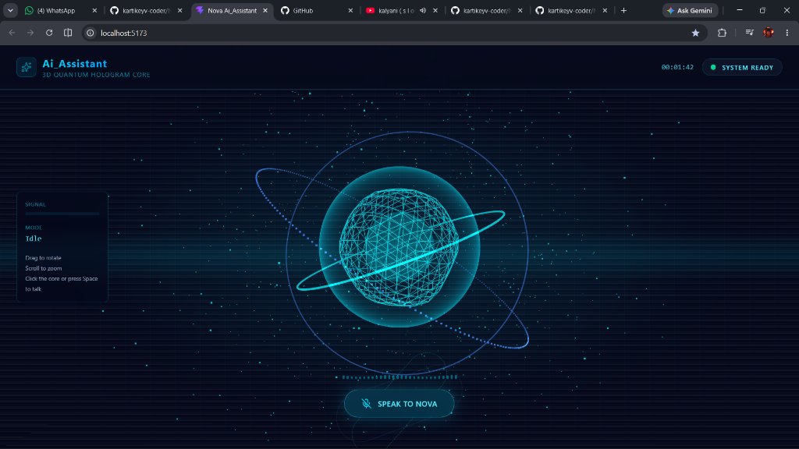
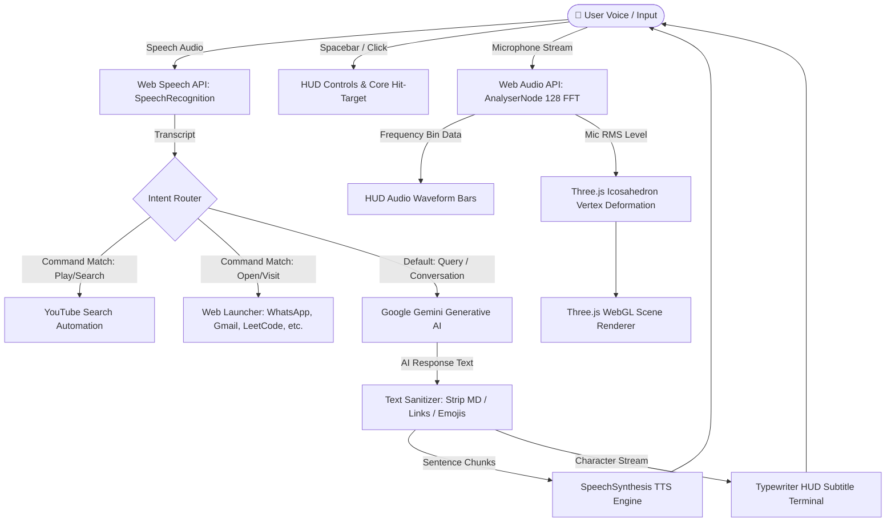

# 🌌 NOVA // 3D Quantum Holographic AI Assistant

<div align="center">

```
  ███╗   ██╗ ██████╗ ██╗   ██╗ █████╗     █████╗ ██╗
  ████╗  ██║██╔═══██╗██║   ██║██╔══██╗   ██╔══██╗██║
  ██╔██╗ ██║██║   ██║██║   ██║███████║   ███████║██║
  ██║╚██╗██║██║   ██║╚██╗ ██╔╝██╔══██║   ██╔══██║██║
  ██║ ╚████║╚██████╔╝ ╚████╔╝ ██║  ██║██╗██║  ██║██║
  ╚═╝  ╚═══╝ ╚═════╝   ╚═══╝  ╚═╝  ╚═╝╚═╝╚═╝  ╚═╝╚═╝
```

### *Next-Generation Voice-Activated Holographic Intelligence*

[](https://react.dev/)
[](https://threejs.org/)
[](https://ai.google.dev/)
[](https://tailwindcss.com/)
[](https://vitejs.dev/)
[](LICENSE)

<br/>



<br/><br/>

[Explore Features](#-features) • [Interface States](#-interface-states) • [Architecture](#-system-architecture) • [Controls](#-controls--navigation) • [Quick Start](#-quick-start)

---

</div>

## 🪐 Overview

**NOVA** is a futuristic, immersive voice assistant interface inspired by sci-fi holographic terminals (like *J.A.R.V.I.S.* and *Cyberpunk 2077*). 

Built on **React 19**, **Three.js WebGL**, and powered by **Google Gemini**, NOVA features a living 3D quantum core that dynamically morphs, pulses, and shifts visual states in real-time according to speech, ambient audio frequencies, and user interactions.

With deep Web Speech API integration, NOVA listens to natural voice commands, opens applications, searches media across the web, and converses with real-time speech synthesis and typewriter HUD telemetry.

---

## ✨ Features

### 🔮 1. Living 3D Quantum Hologram Core
- **Audio-Reactive Mesh Topology**: Dynamic vertex displacement on a 4-frequency wireframe icosahedron responding to live microphone FFT frequencies.
- **Custom Fresnel Glow Shaders**: Additive blended rim glow giving the illusion of a floating energy plasma sphere.
- **Gyroscopic Orbital Rings & Particle Stream**: Multi-axis orbiting quantum rings with 240+ orbital data points orbiting at relativistic speeds.
- **Interactive 900-Star Particle Field**: Responsive 3D particle universe that reacts to cursor proximity, dragging, and hover force fields.
- **Full 6-DOF Orbit Control**: Drag to rotate, scroll to zoom, and interact directly with the 3D core.

### 🎙️ 2. Intelligent Bi-Directional Speech
- **Speech-to-Text (STT)**: Instant voice transcription via the Web Speech API (`SpeechRecognition`).
- **Natural Voice Synthesis (TTS)**: Intelligently selects high-fidelity natural browser voices (`Google English`, `en-IN`, natural neural voices).
- **Sentence Chunking & Real-time Typewriter**: Sub-second text streaming with markdown/emoji sanitization for vocal delivery accompanied by a cyberpunk HUD typewriter terminal.
- **Web Audio API Spectrum Analyser**: Live 128-bin FFT spectrum analyser feeding both the 3D geometry and the HUD audio waveform equalizer.

### ⚡ 3. Voice Automation & Command Protocol
- **YouTube Media Integration**: Plays videos and tracks directly via natural voice queries.
- **Quick-Launch Web App Matrix**: Rapid shortcuts for WhatsApp, Gmail, LeetCode, ChatGPT, Google Maps, and arbitrary web destinations.
- **Google Gemini Generative AI**: Instant fallback to Google Gemini for open-ended intelligence, problem-solving, code explanations, and conversational reasoning.

### 🖥️ 4. Cyberpunk HUD & Telemetry Interface
- **Animated CRT Scanline & Phosphor Beams**: Authentic retro-futuristic display effects.
- **Telemetry Readouts**: Real-time microphone signal level meter, operating mode indicators, and 24-hour military clock.
- **Spacebar Quick-Trigger**: Hit `Space` anywhere to activate or mute voice recognition instantly.

---

## 🎨 Interface States

NOVA visually adapts its shader uniforms, lighting, particle colors, and telemetry depending on the system state:

| State | Core Color | Accent | Status Label | Visual Behavior |
| :--- | :--- | :--- | :--- | :--- |
| **`IDLE`** | Cyan (`#00f3ff`) | Blue (`#3b82f6`) | `System ready` | Gentle ambient breathing, slow orbital precession |
| **`LISTENING`** | Neon Purple (`#a855f7`) | Hot Pink (`#ec4899`) | `Listening…` | Audio FFT vertex distortion, spinning dual HUD dials |
| **`SPEAKING`** | Sky Blue (`#38bdf8`) | Aqua (`#22d3ee`) | `NOVA speaking` | Energetic particle pulse, typewriter transmission feed |

---

## 📐 System Architecture



---

## 🕹️ Controls & Navigation

```
  ┌─────────────────────────────────────────────────────────────┐
  │ [ Spacebar ]           Toggle Voice Listening on / off      │
  │ [ Left-Click Core ]    Click floating 3D orb to speak       │
  │ [ Click & Drag ]       3D Orbit / Camera rotation           │
  │ [ Mouse Scroll ]       Zoom in / Zoom out of the core       │
  │ [ Mouse Move ]         Starfield particle repulsion         │
  └─────────────────────────────────────────────────────────────┘
```

---

## 🚀 Quick Start

### 1. Prerequisites
- **Node.js**: `v18.0.0` or higher
- **Modern Chromium Browser**: Chrome, Edge, Brave, or Opera (recommended for native Web Speech API support)
- **Google Gemini API Key**: Obtain a free API key from [Google AI Studio](https://aistudio.google.com/)

### 2. Clone the Repository
```bash
git clone https://github.com/kartikeyv-coder/Nova-Ai-Assistant.git
cd Nova-Ai-Assistant
```

### 3. Install Dependencies
```bash
npm install
```

### 4. Configure Environment Variables
Create a `.env` file in the root directory:
```env
VITE_GEMINI_API_KEY=your_gemini_api_key_here
```

### 5. Launch Development Server
```bash
npm run dev
```
Open your browser at `http://localhost:5173` and allow microphone access when prompted.

---

## 🛠️ Tech Stack

<div align="center">

| Layer | Technologies |
| :--- | :--- |
| **Frontend Framework** | [React 19](https://react.dev/) + [Vite 8](https://vitejs.dev/) |
| **3D Graphics & Shaders** | [Three.js](https://threejs.org/) (WebGL, Custom GLSL Fresnel Shaders) |
| **Styling & HUD** | [Tailwind CSS v4](https://tailwindcss.com/) + Custom Glassmorphism & Scanline Keyframes |
| **Generative AI** | [@google/generative-ai](https://www.npmjs.com/package/@google/generative-ai) (`gemini-3.5-flash-lite`) |
| **Audio & Speech Engine** | Web Speech API (`SpeechRecognition`, `SpeechSynthesis`) + Web Audio API (`AudioContext`) |
| **Icons & Assets** | [Lucide React](https://lucide.dev/) |

</div>

---

## 🛡️ Privacy & Permissions Note

- **Microphone Access**: NOVA requires browser microphone permissions solely to transcribe your speech and measure live audio levels for the 3D visualizer. No audio recordings are permanently stored or shared with external servers other than prompt text forwarded to Google Gemini.
- **Speech Synthesis**: All text-to-speech audio rendering happens locally on your machine via your browser's speech synthesis engine.

---

## 🤝 Contributing

Contributions, issues, and feature requests are welcome!
Feel free to check the [issues page](https://github.com/kartikeyv-coder/Nova-Ai-Assistant/issues).

1. Fork the Project
2. Create your Feature Branch (`git checkout -b feature/QuantumEnhancement`)
3. Commit your Changes (`git commit -m 'Add audio spectrum smoothing'`)
4. Push to the Branch (`git push origin feature/QuantumEnhancement`)
5. Open a Pull Request

---

## 📄 License

Distributed under the **MIT License**. See `LICENSE` for more information.

<div align="center">

Made with ⚡ and 🌌 by [kartikeyv-coder](https://github.com/kartikeyv-coder)

</div>
